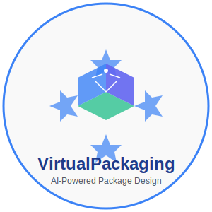
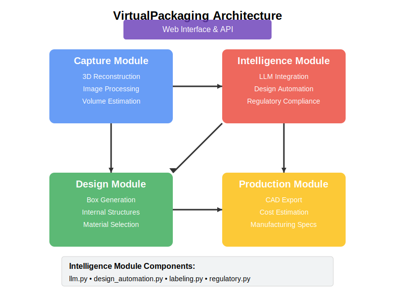

# 📦 VirtualPackaging

<div align="center">
  
  
  <p>
    <strong>AI-Powered Automated Packaging Design System</strong><br>
    Transform product photos into optimal packaging solutions through 3D reconstruction and LLM interaction
  </p>

  <p>
    <a href="#features">Features</a> •
    <a href="#architecture">Architecture</a> •
    <a href="#installation">Installation</a> •
    <a href="#usage">Usage</a> • <a href="DEPLOYMENT.MD">Deployment</a> •
    <a href="#development">Development</a> •
    <a href="#license">License</a>
  </p>
</div>

<p align="center">
  
</p>

> **Note:** This project is based on a patent by Ucaretron Inc. (Inventor: Jee Hwan Jang)

## 🌟 Overview

VirtualPackaging revolutionizes the traditional packaging design process by leveraging cutting-edge AI technologies. The system automates the entire workflow from 3D product scanning to factory-ready packaging designs, dramatically reducing time and costs while optimizing for both product protection and environmental considerations.

The conventional packaging design process typically involves numerous variables, requires significant time and expense, and demands specialized expertise. VirtualPackaging transforms this workflow with a simple, intuitive approach:

1. **Capture** product images using a smartphone
2. **Generate** 3D reconstructions of your products
3. **Design** optimal packaging with AI assistance
4. **Customize** through interactive LLM conversations
5. **Export** factory-ready CAD files for immediate production

## ✨ Features

<p align="center">
  
</p>

### 3D Reconstruction & Analysis
- Multi-angle smartphone image capture for accurate 3D modeling
- Depth camera support for enhanced precision
- Automatic volume estimation and optimization
- Internal structure generation for product stabilization

### AI-Powered Design
- Intelligent package form factor selection based on product requirements
- Automatic material selection considering sustainability and protection
- Optimal package size calculation to minimize waste
- Regulatory compliance verification built-in

### LLM-Enhanced Interactivity
- Natural language conversations to refine packaging designs
- Contextual suggestions for packaging improvements
- Automatic generation of package text, labels, and warnings
- Intelligent placement of text elements based on package geometry

### Factory-Ready Output
- Direct CAD export for manufacturing systems
- Cost estimation based on design parameters
- Manufacturing process optimization
- Quality assurance simulations

### Cloud & Web Integration
- Browser-based design interface
- Cloud storage for designs and templates
- Collaboration features for team-based projects
- API endpoints for integration with existing systems

## 🏗️ Architecture

<p align="center">
  
</p>

### Core Components

#### 1. Capture Module
The capture module processes images from smartphones or depth cameras, applying 3D reconstruction algorithms to create accurate digital models of physical products.

#### 2. Intelligence Engine
Combining computer vision, 3D analysis, and large language models to generate optimal packaging solutions, considering factors like:
- Product dimensions and fragility
- Packaging materials and sustainability
- Cost optimization
- Manufacturing constraints
- Regulatory requirements

#### 3. User Interface
Browser-based interactive design environment allowing users to:
- View 3D models of products and packaging
- Engage in natural language conversations to refine designs
- Customize packaging elements through intuitive controls
- Preview final designs with realistic rendering

#### 4. Production Pipeline
Transforms digital designs into manufacturing-ready outputs:
- CAD file generation for die-cutting
- Printing specifications for graphics
- Assembly instructions
- Cost estimation and optimization

## 🚀 Installation

```bash
# Clone the repository
git clone https://github.com/JJshome/VirtualPackaging.git

# Navigate to the project directory
cd VirtualPackaging

# Install dependencies
pip install -r requirements.txt

# Set up environment variables
cp .env.example .env
# Edit .env with your API keys and configuration

# Start the development server
python manage.py runserver
```

## 🚢 Deployment

For detailed deployment instructions, please see the [DEPLOYMENT.MD](DEPLOYMENT.MD) file.

### Requirements

- Python 3.10+
- Node.js 18+
- GPU with CUDA support (recommended for 3D processing)
- OpenAI API key or equivalent LLM access
- MongoDB or PostgreSQL

## 🖥️ Usage

### Web Interface

1. Access the web application at `http://localhost:8000`
2. Upload product images or use a connected depth camera
3. Wait for 3D reconstruction to complete
4. Interact with the AI to refine packaging design
5. Export final designs for manufacturing

### API Endpoints

```python
# Python example using the VirtualPackaging API
import requests

# Initialize a new project
response = requests.post(
    "https://api.virtualpackaging.com/projects/new",
    json={
        "name": "My Product Packaging",
        "description": "Eco-friendly package for fragile electronics"
    },
    headers={"Authorization": "Bearer YOUR_API_KEY"}
)

project_id = response.json()["project_id"]

# Upload images for 3D reconstruction
with open("product_front.jpg", "rb") as img:
    requests.post(
        f"https://api.virtualpackaging.com/projects/{project_id}/images",
        files={"image": img},
        headers={"Authorization": "Bearer YOUR_API_KEY"}
    )

# Generate packaging design
response = requests.post(
    f"https://api.virtualpackaging.com/projects/{project_id}/generate",
    json={
        "preferences": {
            "material": "recycled_cardboard",
            "color_scheme": "brand_colors",
            "optimization_priority": "minimal_waste"
        }
    },
    headers={"Authorization": "Bearer YOUR_API_KEY"}
)

# Export CAD files
response = requests.get(
    f"https://api.virtualpackaging.com/projects/{project_id}/export",
    params={"format": "step"},
    headers={"Authorization": "Bearer YOUR_API_KEY"}
)
```

## 💻 Development

### Project Structure

```
VirtualPackaging/
├── core/                     # Core application logic
│   ├── capture/              # 3D reconstruction from images
│   ├── design/               # Packaging design generation
│   ├── intelligence/         # AI components (LLM, optimization)
│   └── integration/          # Module integration logic
├── web/                      # Web application
│   ├── frontend/             # React-based UI
│   └── api/                  # FastAPI backend services
├── tests/                    # Automated tests for core and web modules
├── docker/                   # Docker configurations
├── docs/                     # Documentation and project assets
├── examples/                 # Example scripts and use cases
├── .env.example              # Example environment variables
├── requirements.txt          # Python dependencies
├── setup_env.sh              # Environment setup script
├── docker-compose.yml        # Docker Compose configuration
├── CONTRIBUTING.md           # Guidelines for contributors
├── DEPLOYMENT.MD             # Deployment instructions
├── LICENSE                   # Project license
└── README.md                 # This file
```

### Contributing

We welcome contributions to VirtualPackaging! Please check out our [contributing guidelines](CONTRIBUTING.md) for detailed information on how to get involved.

1. Fork the repository
2. Create your feature branch (`git checkout -b feature/amazing-feature`)
3. Commit your changes (`git commit -m 'Add some amazing feature'`)
4. Push to the branch (`git push origin feature/amazing-feature`)
5. Open a Pull Request

## 📄 License

This project is licensed under the MIT License - see the [LICENSE](LICENSE) file for details.

## 🔗 Related Projects

- 3D-Reconstruction-Toolkit (will be linked later...)
- Packaging-Optimization-Library (will be linked later...)
- LLM-Design-Assistant (will be linked later...)

> **Note:** These complementary projects are currently under development and will be linked when they become publicly available.

## 🔬 External Datasets and Resources

The project leverages or is compatible with the following external resources:

- [NVIDIA DynPose-100K](https://huggingface.co/datasets/nvidia/dynpose-100k) - A large-scale dataset containing 100K+ human poses that can be utilized for ergonomic packaging design and human-product interaction analysis
- [Open3D](http://www.open3d.org/) - Open-source library for 3D data processing
- [OpenAI API](https://openai.com/api/) - For LLM-based design recommendations

## 📚 Citation

If you use VirtualPackaging in your research or projects, please cite:

```bibtex
@misc{jang2023virtualpackaging,
  author = {Jang, Jee Hwan},
  title = {Automation Method of Package Making},
  year = {2023},
  publisher = {Ucaretron Inc.},
  howpublished = {\url{https://github.com/JJshome/VirtualPackaging}}
}
```